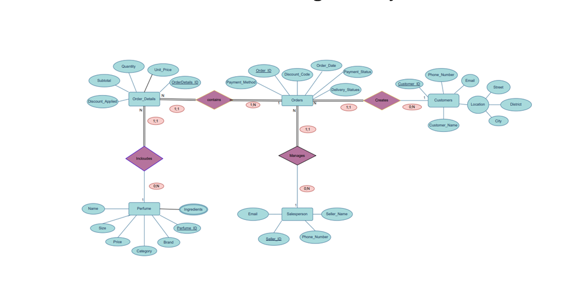
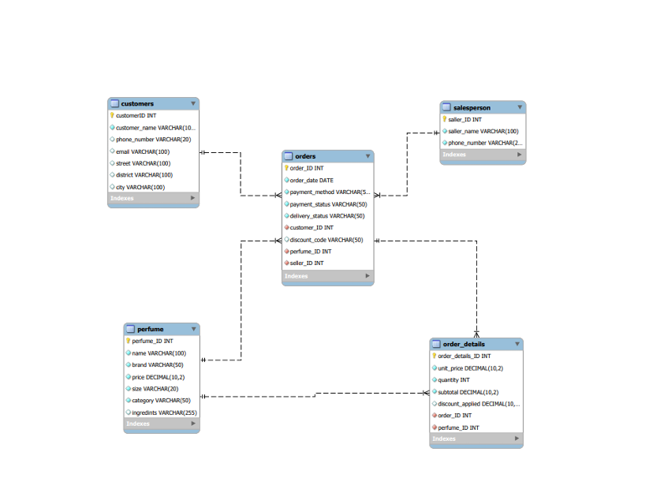
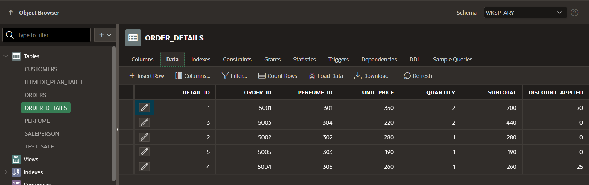
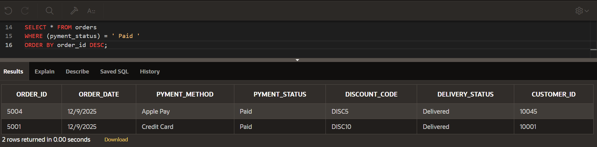
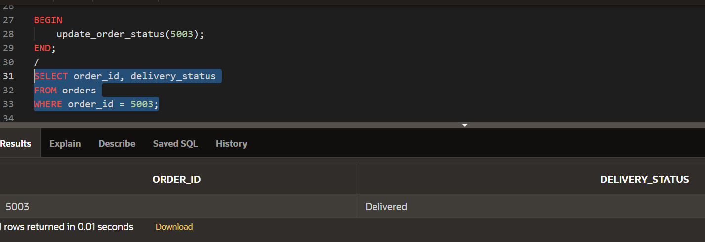
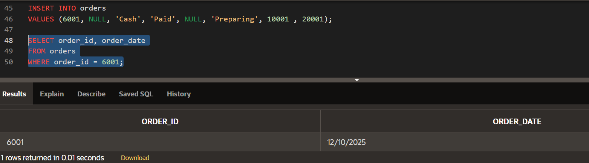

# 🌸 Perfume Store Database

A database project for managing a perfume store using **Oracle Database**, **SQL**, and **PL/SQL**.

## 📖 Project Overview

This project demonstrates the design and implementation of a relational database for a perfume store. It includes database design, relationships, sample data, SQL queries, and PL/SQL objects such as stored functions, procedures, and triggers.

---

## 🛠️ Technologies Used

- Oracle Database
- SQL
- PL/SQL

---

## 📂 Project Structure

```
Perfume-Store-Database/
│
├── setup.sql
├── queries.sql
├── tests.sql
├── README.md
└── docs/
    ├── ERD.png
    ├── Database-Relation-Schema.png
    ├── Tables.png
    ├── Query-Result.png
    ├── Procedure-Test.png
    └── Trigger-Test.png
```

---

## 📋 Database Tables

- Customers
- Perfume
- Salesperson
- Orders
- Order_Details

---

## ✨ Features

- Relational database design
- Primary and Foreign Key constraints
- Sample data insertion
- SQL queries
- Stored Function
- Stored Procedure
- Database Trigger

---

## ▶️ How to Run

1. Run `setup.sql` to create the database objects and insert sample data.
2. Run `queries.sql` to execute SQL queries.
3. Run `tests.sql` to test the function, procedure, and trigger.

---

# 📸 Database Design

### Entity Relationship Diagram (ERD)



### Database Relation Schema



---

# 📸 Database Tables



---

# 📸 SQL Query Result



---

# 📸 Stored Procedure Test


---

# 📸 Trigger Test



---

## 👩‍💻 Author

**Aryam Attia**